# CBNU

> 충북대학교 산업인공지능학과 석사과정 포트폴리오

수업 실습과 프로젝트, 개별 연구 코드를 다섯 주제별로 정리했습니다.

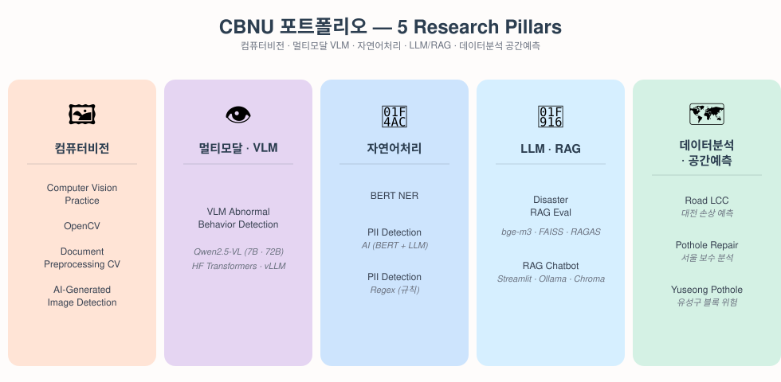

| 분야 | 포함 프로젝트 |
|------|---------------|
| 🖼 컴퓨터비전 | Computer Vision_Practice · OpenCV · Document_Preprocessing_CV · AI_Generated_Image_Detection |
| 👁 멀티모달 · VLM | vlm_abnormal_behavior_detection |
| 💬 자연어처리 | NER · pii_detection_AI · pii_detection_regex |
| 🤖 LLM · RAG | disaster-rag-eval · RAG_chatbot |
| 🗺 데이터분석 · 공간예측 | road_LCC · pothole_repair_analysis · yuseong_pothole_risk |

> *수업용 실습 폴더 `DeepLearning_Advanced`는 하단에 별도 명시.*

---

# 🖼 컴퓨터비전

색공간 변환 · 필터링 · 특징 추출(엣지/코너/주파수) 같은 **고전 비전 알고리즘**을 중심으로,
문서 OCR 전처리와 AI 생성 이미지 판별까지 응용 프로젝트로 연결했습니다.

## ▷ Computer Vision_Practice

산업 컴퓨터비전 수업의 **주차별 실습 노트북**입니다.

색공간 변환과 필터링, 엣지 · 코너 검출, 특징점 매칭, 카메라 캘리브레이션,
스테레오 비전, 객체 검출까지 강의 순서대로 다룹니다.

▸ **주요 기술** — OpenCV · Sobel/Canny · Harris · SIFT · Hough Transform ·
Haar Cascade & LBP 얼굴 검출 · 핀홀 카메라 캘리브레이션 · 스테레오 정합

## ▷ OpenCV

**영상처리 기초 실습** 노트북입니다. 필터링과 화질 개선의 기본 연산을 직접 구현해 결과를 비교했습니다.

▸ **주요 기술** — Average / Laplacian / Sharpening 필터 · 히스토그램 처리 · 영상 입출력

## ▷ Document_Preprocessing_CV

사진 · 스캔 문서를 OCR이 잘 읽도록 고전 비전 알고리즘으로 전처리하고,
전처리 전후 인식률을 정량 비교한 **CV 중간 프로젝트**입니다.

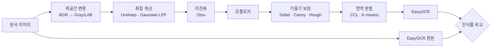

▸ **주요 기술** — Unsharp Masking · Otsu 이진화 · 모폴로지 연산 ·
Hough 기반 기울기 보정 · 연결요소 라벨링(CCL) · K-means 영역 분할 · EasyOCR

## ▷ AI_Generated_Image_Detection

딥러닝 탐지기 없이 handcrafted feature만으로 실사진과 생성 이미지를 구분하고,
학습에 쓰지 않은 다른 생성기(Gemini)에도 통하는지 **일반화 성능**을 검증한 **CV 기말 프로젝트**입니다.

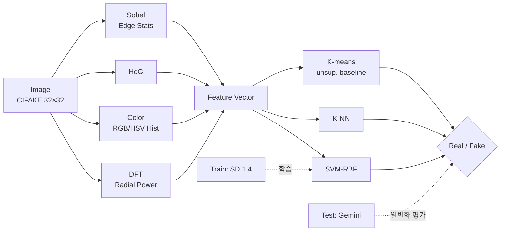

▸ **주요 기술** — DFT 방사형 파워 스펙트럼 · RGB/HSV 히스토그램 · HoG ·
Sobel 엣지 통계 · SVM(RBF) · K-NN · K-means 베이스라인 · CIFAKE 데이터셋

---

# 👁 멀티모달 · VLM

Vision-Language 모델을 산업/보안 응용에 접목한 연구.

## ▷ vlm_abnormal_behavior_detection

Vision-Language Model로 CCTV 이미지의 **이상행동(흡연 등)** 을 탐지하는 시스템 연구입니다.

모델별 서빙 가능성(GGUF 양자화 · Tensor Parallel · HF Transformers 직접 로드)을 비교하고,
ROI 기반 전처리와 프롬프트 설계에 따른 정탐 · 오탐 영향을 평가했습니다.

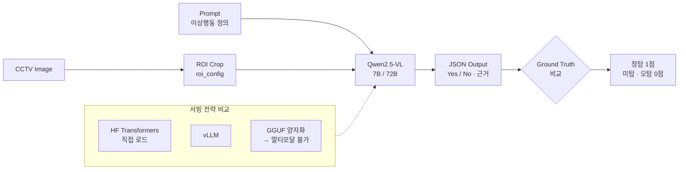

▸ **주요 기술** — Qwen2.5-VL (7B / 72B) · Hugging Face Transformers · vLLM ·
ROI 기반 입력 전처리 · 프롬프트 엔지니어링 · 멀티 GPU 분산 로드

---

# 💬 자연어처리

토큰 분류 기반 **개체명 인식**부터 개인정보 비식별화까지. 규칙 기반과 AI 기반을 비교해
서로의 사각지대를 메우는 Hybrid 접근을 실험했습니다.

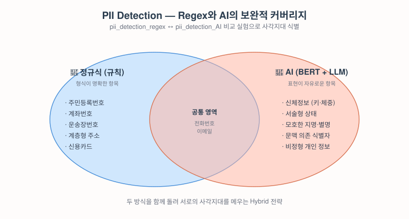

## ▷ NER

**BERT 기반 개체명 인식** 모델의 학습과 추론 코드입니다.
토큰 단위 태깅 문제로 정의하고 파인튜닝했습니다.

▸ **주요 기술** — bert-base-multilingual-cased · Hugging Face Transformers ·
Token Classification · Trainer API · Early Stopping

## ▷ pii_detection_AI

개인정보 비식별화를 AI 모델로 처리한 실험입니다.
BERT NER로 1차 탐지한 뒤 LLM으로 2차 검증하는 **2단계 구조**입니다.

정규식으로 잡기 어려운 신체정보처럼 표현이 자유로운 항목을 LLM이 보완합니다.

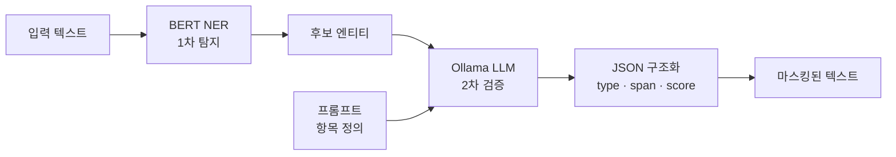

▸ **주요 기술** — BERT Token Classification · Ollama 로컬 LLM 검증 ·
프롬프트 엔지니어링 · JSON 구조화 출력

## ▷ pii_detection_regex

같은 개인정보 탐지 문제를 **규칙 기반으로 푼 비교군**입니다.
주소, 계좌번호, 운송장번호처럼 형식이 정해진 항목을 정규식으로 탐지합니다.

AI 방식과 대조해 규칙 기반의 정확도와 한계를 확인하는 용도입니다.

▸ **주요 기술** — 계층형 주소 패턴 매칭 · 키워드 기반 문맥 판별 · 정규식 최적화

---

# 🤖 LLM · RAG

로컬 LLM 서빙과 벡터 검색을 조합한 응용. 평가 중심의 재난 QA 파이프라인과,
사용자가 바로 돌릴 수 있는 경량 챗봇 두 축으로 다뤘습니다.

## ▷ disaster-rag-eval

재난안전 행동요령 QA를 대상으로 **RAG 파이프라인을 구축하고 평가**한 프로젝트입니다.

재난 유형별 행동요령 15종을 지식베이스로 삼아 검색 · 생성 · 평가 전 과정을 자동화했습니다.
Base 모델과 파인튜닝 모델, RAG 적용 여부를 조합해 성능 차이를 측정했습니다.

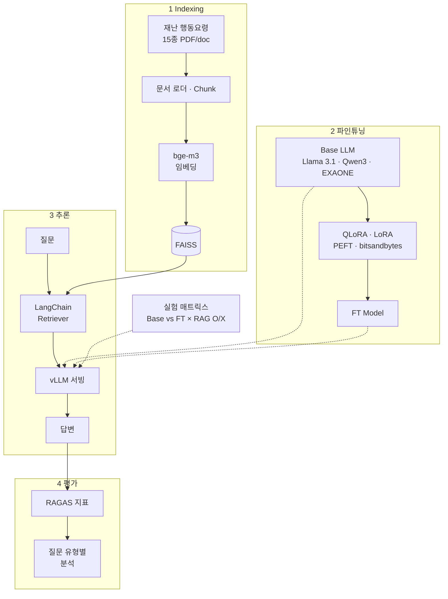

▸ **주요 기술** — BAAI/bge-m3 임베딩 · FAISS 벡터 검색 · LangChain ·
Llama-3.1-8B / Qwen3-8B / EXAONE-3.5-7.8B 비교 · QLoRA & LoRA 파인튜닝(PEFT, bitsandbytes) ·
vLLM 추론 서빙 · RAGAS 정량 평가(질문 유형별 분석 포함)

## ▷ RAG_chatbot

로컬 LLM과 벡터 DB를 붙여 지식 저장소 기반 질의응답을 수행하는 **Streamlit 웹 챗봇**입니다.

`knowledge/` 폴더에 문서를 넣으면 청킹 · 임베딩 · 저장이 자동 처리되고,
질문에 대해 top-K 검색된 컨텍스트와 함께 **스트리밍**으로 답변을 생성합니다.

LangChain 같은 프레임워크 없이 Ollama HTTP API · ChromaDB를 직접 호출해 가볍게 구성했습니다.

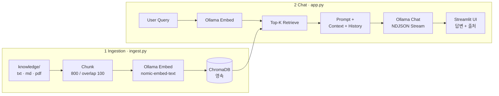

▸ **주요 기술** — Streamlit 챗 UI · Ollama (로컬 LLM + 임베딩) · ChromaDB 영속 저장 ·
문서 청킹 / NDJSON 스트리밍 · PDF · Markdown · 평문 로더

---

# 🗺 데이터분석 · 공간예측

도로/인프라를 공간-시간 축에서 바라보고, **공공 데이터(기상 · 교통 · OSM) 를 융합**해
포트홀 발생을 분석/예측한 연구들입니다.

## ▷ road_LCC

대전시 도로 손상 탐지 데이터와 날씨 · 교통 피처를 결합해
**Life Cycle Cost 관점의 손상 예측**을 탐색한 연구입니다.

지오코딩 · VDS 교통량 매칭 · 지도 시각화를 포함한 데이터 통합 파이프라인을 구축했습니다.

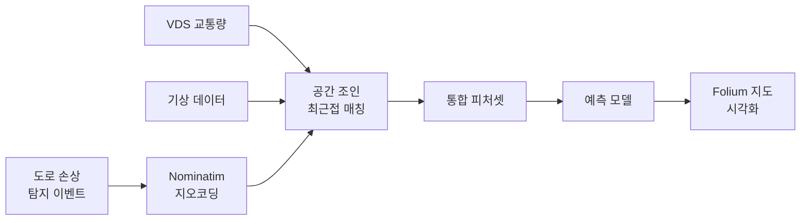

▸ **주요 기술** — Geopandas · Nominatim 지오코딩 · VDS 교통량 매칭 ·
Folium 지도 시각화 · 분류 모델

## ▷ pothole_repair_analysis

서울시 포트홀 보수 위치 공공 데이터와 ASOS 기상 · VDS 교통량 · 도로 등급을 결합해
보수 발생 패턴과 요인을 분석한 **산업빅데이터 기말 프로젝트**입니다.

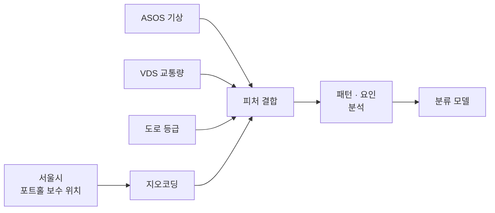

▸ **주요 기술** — 공공데이터 통합 · 기상 · 교통 피처 융합 ·
포트홀 ↔ 교통량 매칭 · 분류 모델

## ▷ yuseong_pothole_risk

유성구 도로를 10m · 100m · 200m 블록으로 분할하고
**블록 × 월 단위 panel 데이터**를 구성해 다음 달 포트홀 발생 위험을 예측한
시공간 예측 연구입니다. 날씨 롤링(30d · 90d), OSM 도로망 피처, 교통량 proxy를 포함한 피처셋으로
XGBoost · LightGBM 모델을 비교했습니다.

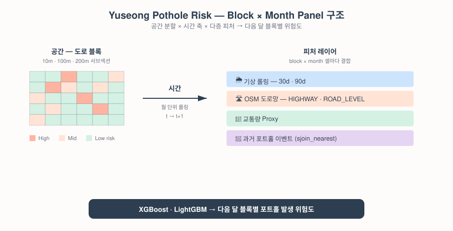

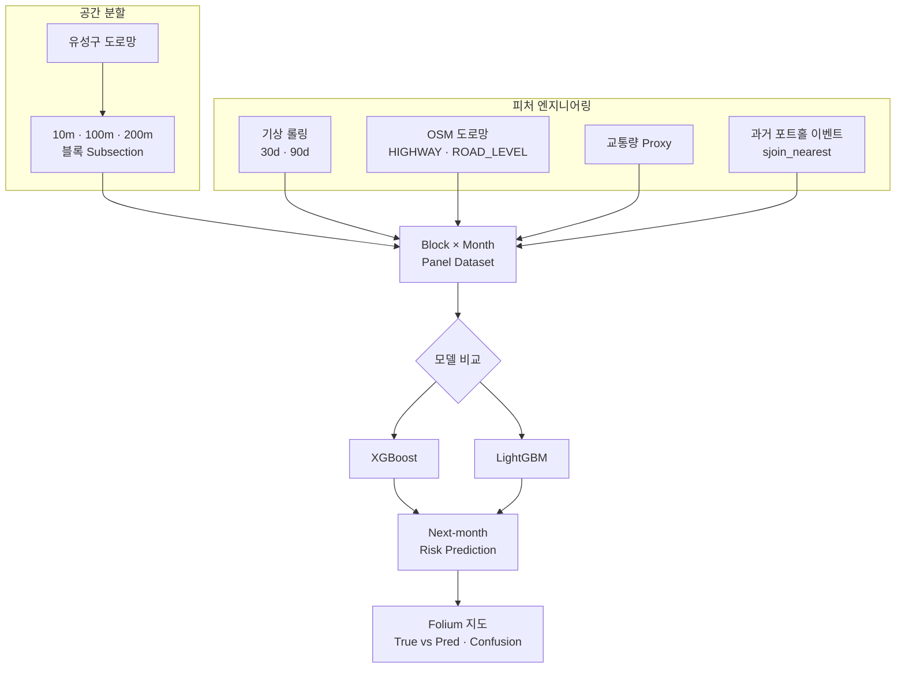

▸ **주요 기술** — 블록 기반 공간 분할 · panel 데이터 구성 · 날씨 롤링 피처 ·
OSM 도로망 확장 · XGBoost / LightGBM · Folium 결과 지도

---

# 📎 기타

## ▷ DeepLearning_Advanced

딥러닝 심화 수업의 **주차별 실습 코드** 폴더입니다.
CNN · RNN · Transformer 계열 모델 구현과 학습 실험을 다룹니다.

▸ *실습 진행에 따라 순차적으로 추가됩니다.*
